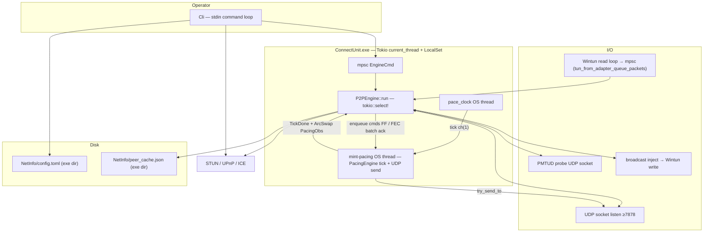

# Mint-ConnectUnit

- A light-weight portable serverless peer-to-peer VPN for **Windows**, optimized for low-bandwidth, low-latency tasks.
- Using **Wintun** TAP adapter
- There is no central data-plane server, only optional STUN/UPnP for NAT traversal.

This document is the **project orientation guide**. For locked wire behaviour, engine internals, source layout, and numeric defaults, see **[`SPEC.md`](SPEC.md)**.

---

## Table of contents

1. [Quick start](#quick-start)
2. [Features](#features)
3. [Build and run](#build-and-run)
4. [Architecture](#architecture)
5. [Roles: owner vs peer](#roles-owner-vs-peer)
6. [CLI commands](#cli-commands)
7. [Configuration](#configuration)

---

## Quick start

1. Run `ConnectUnit.exe`(or your binary build name) as **Administrator**, make sure you have `wintun.dll` in the same folder with the binary.
2. Window defender may block it? -> More info -> Run anyway if you trust me.
3. Command Line Interface -> type [1] to create server, [2] to join a server
  - If you are not a power-user -> Just press Enter, it will automatically setup a new server.
    - To invite someone to join -> Copy the Public Invite ID and send to them (or LAN Invite ID if they are in the same wifi/network).
    - In CLI, type `?`  for help or read docs.
  - If you join a server:
    - Type [1] (recommended) or just press enter for `Decentralized` (using BitTorrent tracker to find others) -> paste the Public Invite ID -> Usually it will take about 1 minutes to join.
    - Type [2] for `Parasitic` mode -> Basically, just use this option when you want to use other VPNs as a free signaling server to start handshake instead of BitTorrent tracker.
4. Should know that the VPN will run in the background until you open CLI and type `stop` (it still run if you just close the CLI window).
5. File `NetInfo/config.toml` automatically generate for our power-user.

## Features

- **Serverless P2P** — no central data-plane server; the owner node coordinates membership while STUN/UPnP/ICE handle NAT traversal and BitTorrent-style trackers handle discovery
- **Encrypted data plane** — AEGIS-128L data plane, HMAC-BLAKE2b control plane
- **Adaptive pacing & congestion control** — token bucket + deficit round-robin (DRR) + adaptive burst (APD) to bound latency under load
- **Forward error correction** — Reed–Solomon shards recover lost packets without waiting on retransmission
- **Automatic failover** — quality-scored routing switches between direct and owner-relayed paths, with hysteresis to avoid flapping
- **Full NAT traversal** — STUN, UPnP, ICE-style candidates, canonical hole punching, plus a LAN "parasitic join" mode that needs no invite
- **Path MTU discovery** — adaptive shard/frame sizing to the live path MTU

---

## Build and run

**Requirements:** Windows, Rust **1.95+**, administrator privileges at runtime (Wintun / adapter / some `netsh` operations).

The release binary embeds a **`requireAdministrator`** manifest: double-click or shortcut launch shows **UAC**; approve to run elevated. Declining UAC exits with an administrator-required message.

```powershell
cargo build --release
```

Binary name: **`ConnectUnit.exe`**. Place **`wintun.dll`** next to it (Windows build embeds the app icon from `windows/ConnectUnit.ico` via `winres`).

```powershell
cargo run
```

On first launch, the interactive CLI offers **[1] Create** (owner), **[2] Join** (peer), or **[3] Exit**. After setup, **`NetInfo/config.toml`** next to the executable restores the session (working directory does not matter).

---

## Architecture



One **`P2PEngine`** task owns RX/decrypt/routing/encrypt; a **`mint-pacing`** OS thread owns paced UDP send. The owner allocates VIPs and relays when direct paths degrade. Details: **[`SPEC.md`](SPEC.md)**.

---

## Roles: owner vs peer

| | **Owner** | **Peer** |
|---|-----------|----------|
| VIP pool | Allocates new peer VIPs on join | Receives assigned VIP |
| `config.toml` peers | Authoritative peer list | Stores owner endpoint + crypto |
| Relay | Relays packets for peers on degraded paths | Uses owner as relay when needed |
| Membership sync | Publishes membership / route sync | Applies deltas from owner |
| Parasitic listener | Can accept LAN parasitic joins | Can join via first-run menu without a full invite |
| Kick | Can disconnect a peer | Clears local session on kick |

Full detail on membership sync, kick/removal, and the parasitic join handshake: **[`SPEC.md` § Membership sync](SPEC.md#membership-sync-msyn)** and **[§ NAT, hole punch, and parasitic join](SPEC.md#nat-hole-punch-and-parasitic-join)**.

---

## CLI commands

Interactive loop after session restore (`?` = help):

| Command | Description |
|---------|-------------|
| First-run `[1]` Create | New network (owner): name, port, VIP, subnet, UPnP, STUN, invites (idle only) |
| First-run `[2]` Join | Join via wizard: decentralized (default), parasitic, or manual — not while a profile is active (`remove` first) |
| First-run `[3]` / `stop` / `exit` | Shut down VPN daemon and quit client |
| `list` | Peers and routes |
| `runtime` | Live dashboard: counters, VPN byte rates, pacing/UDP/TUN buffers (1s; Enter to stop) |
| `ping` | Latency to peers |
| `kick` | Disconnect peer (owner) |
| `remove` | Remove peer from config |
| `stun` | Query public endpoint |
| `punch` | Manual hole punch to host:port |
| `config show` / `config reload` / `config reset` | Performance via `NetInfo/config.toml` (show, merge from disk + apply live, factory reset) |
| `autoclear-on` / `autoclear-off` | Toggle clearing the terminal before each command (default: on) |
| `stop` | Exit (disconnect VPN and quit) |

---

## Configuration

Two files live in **`NetInfo/`**, next to `ConnectUnit.exe`:

| File | Contents |
|------|----------|
| `config.toml` | Identity, role, crypto, peers, invites, parasitic state, and all pacing/APD/DRR/FEC/failover tuning knobs (sectioned by feature: `[session]`, `[drr]`, `[fec]`, `[congestion]`, …) |
| `peer_cache.json` | Learned peer endpoints, maintained by the engine |

Edit `config.toml`, then run `config reload` to apply performance fields live. Identity/session fields (network id, role, VIP, keys) require a daemon restart.

Full field list, factory defaults, and what each knob trades off: **[`SPEC.md` § Persistence](SPEC.md#persistence)** and **[§ Operational defaults](SPEC.md#operational-defaults-user-tunable)**.

---

## License

This project's **own source code** is licensed under the **MIT License** — see [LICENSE](LICENSE).

This project also **bundles or depends on third-party components under their own, separate licenses**, which are not covered or superseded by the MIT license above:

| Component | License | Notes |
|-----------|---------|-------|
| **Wintun** (`wintun.dll`) | WireGuard LLC's own *Prebuilt Binaries License* (not MIT/GPL) | Bundled binary, Copyright © WireGuard LLC. Full text: [`licenses/wintun-LICENSE.txt`](licenses/wintun-LICENSE.txt) (copied verbatim from the official wintun.net release archive) |
| Rust crate dependencies | MIT / Apache-2.0 | Full list + license texts: [`THIRD_PARTY_LICENSES.md`](THIRD_PARTY_LICENSES.md) |
