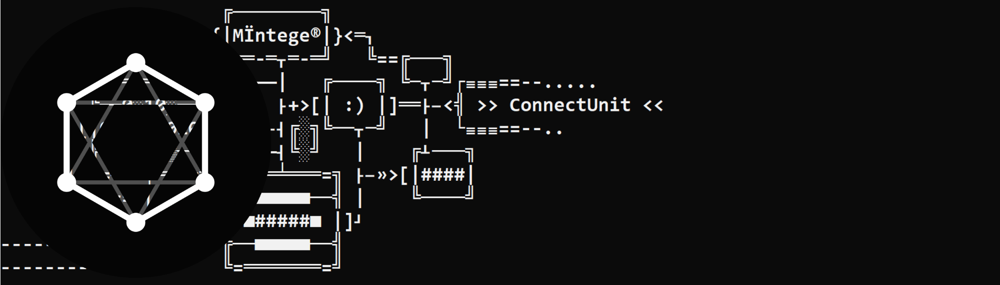
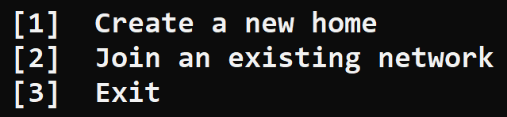
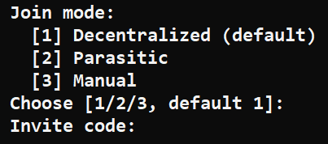
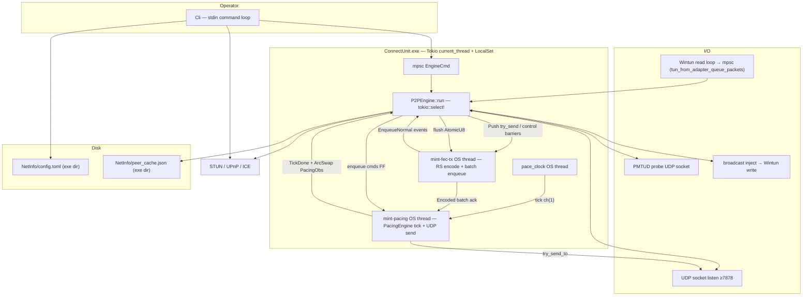

# Mint-ConnectUnit



- A light-weight portable serverless peer-to-peer VPN for **Windows** (at least now), optimized for low-bandwidth, low-latency tasks.
- Using **Wintun** TAP adapter
- There is no central data-plane server, only optional STUN/UPnP for NAT traversal, no online account needed.

This document is the **project orientation guide**. For locked wire behaviour, engine internals, source layout, and numeric defaults, see **[`SPEC.md`](SPEC.md)**.

---

NOTE: Please note that this is a very first project created as a hobby by someone learning Rust programming and networking. It is still under development, has high algorithmic complexity, supported by AI, has been evaluated, audited, debugged by a single person. Although it features secure encryption, the project initially aimed not at high security but at optimizing latency and transmission stability, as well as for power users who want to optimize their own network systems and learn more about network algorithms through its deep configuration parameter adjustments and documentation. It is recommended not to use it for transmitting sensitive information. I sincerely hope to receive feedback or genuine contributions from those with more experience than me in the future.

---

## Table of contents

1. [Quick start](#quick-start)
2. [Features](#features)
3. [Build and run](#build-and-run)
4. [Architecture](#architecture)
5. [FloatUnit members](#floatunit-members)
6. [CLI commands](#cli-commands)
7. [Configuration](#configuration)

---

## Quick start

1. Run `ConnectUnit.exe`(or your binary build name) as **Administrator**, make sure you have `wintun.dll` in the same folder with the binary.
2. Window defender may block it (need administrator privileges to install Wintun driver). -> `More info` -> `Run anyway` if you trust me.
3. Command Line Interface, first run:
- type `1` to create FloatUnit, `2` to join


- If you are not a power-user -> Just press Enter, it will automatically setup a new room.
  - To invite someone to join -> Copy the Invite ID (key-only) and send it to them.
  - In CLI, type `?`  for help or read docs.

- If you join a FloatUnit:


- Type `1` (recommended) or just press enter for "Decentralized" (using BitTorrent tracker to find others) -> paste the Invite ID -> Usually it will take about 1 min to join.
  - Type `2` for "Manual" invite join (paste invite, then type peer `ip:port`; Public or LAN punch path).
- After you already hold a FloatUnit key, type `lan` to discover same-unit members on the local LAN and punch toward them.
4. Should know that the VPN will run in the background until you open CLI and type `stop` (it still run if you just close the CLI window).
5. File `NetInfo/config.toml` automatically generate for our power-user.

## Features

- **Serverless P2P**: no central data-plane server; equal FloatUnit members share a network key while STUN/UPnP/ICE handle NAT traversal and BitTorrent-style trackers handle discovery
- **Encrypted data plane**: AEGIS-128L data + control plane
- **Adaptive pacing & congestion control**: token bucket + deficit round-robin (DRR) + adaptive pressure drain (APD) to bound latency under load
- **Adaptive FEC**: Reed-Solomon shards recover lost packets without waiting on retransmission; ratio follows peer RX wire-loss feedback in pong + loss classifier
- **Automatic failover**: quality-scored routing switches between direct and one-hop hub-relayed paths
- **NAT traversal**: STUN, UPnP, ICE-style candidates, canonical hole punching, plus same-key LAN discover assist
- **Packetization Layer Path MTU Discovery**: adaptive shard/frame sizing to the live path MTU

---

## Build and run

[](https://github.com/4bit-minteger/Mint-ConnectUnit/actions/workflows/build.yml)

**Requirements:** Windows, Rust **1.95+**, administrator privileges at runtime (Wintun / adapter / some `netsh` operations).

The release binary embeds a **`requireAdministrator`** manifest: double-click or shortcut launch shows **UAC**; approve to run elevated. Declining UAC exits with an administrator-required message.

```powershell
cargo build --release
```

Binary name: **`ConnectUnit.exe`**. Place **`wintun.dll`** next to it (Windows build embeds the app icon from `windows/ConnectUnit.ico` via `winres`).

```powershell
cargo run
```

On first launch, the interactive CLI offers **[1] Mint FloatUnit** (member), **[2] Join**, or **[3] Exit**. The invite is key-only (no endpoint in the invite). After setup, **`NetInfo/config.toml`** next to the executable restores the session (working directory does not matter).

---

## Architecture



One **`P2PEngine`** task owns RX/decrypt/routing/encrypt; **`mint-fec-tx`** owns Reed–Solomon TX encode; **`mint-pacing`** owns paced UDP send. Equal members self-claim VIPs and use quality-based one-hop hub relay when direct paths degrade. Details: **[`SPEC.md`](SPEC.md)**.

---

## FloatUnit members

Every peer with the FloatUnit key is an equal **member**.

| | **Member** |
|---|------------|
| VIP | Self-claims a host in the subnet; conflicts: lower hex `node_id` wins, loser bumps `vip_epoch` and rerolls |
| Roster | `config.peers` FIFO 64 from claim gossip (`MCLG` / `MLEA`) |
| Relay | Sticky/best-quality peer hub when `should_relay` |
| LAN assist | Same-key LAN presence (`MPHI`/`MPHR` by `network_id`) then punch + `MPJN` |
| Exclusion | Rotate to a new FloatUnit key (no kick) |

Full detail: **[`SPEC.md`](SPEC.md)** membership gossip, NAT/LAN assist, and wire contract sections.

---

## CLI commands

Interactive loop after session restore (`?` = help):

| Command | Description |
|---------|-------------|
| First-run `[1]` Mint FloatUnit | New unit (member): name, port, VIP, subnet, UPnP, STUN, key-only invite |
| First-run `[2]` Join | Join via wizard: decentralized (default) or manual — not while a profile is active (`remove` first) |
| First-run `[3]` / `stop` / `exit` | Shut down VPN daemon and quit client |
| `list` | Peers and routes |
| `runtime` | Live dashboard: counters, VPN byte rates, pacing/UDP/TUN buffers (1s; Enter to stop) |
| `ping` | Latency to peers |
| `lan` | Discover same-FloatUnit members on LAN and assist (punch + claim hello) |
| `remove` | Clear session and config (destructive) |
| `stun` | Query public endpoint |
| `punch` | Manual hole punch to host:port |
| `config show` / `config reload` / `config reset` | Performance via `NetInfo/config.toml` (show, merge from disk + apply live, factory reset) |
| `autoclear-on` / `autoclear-off` | Toggle clearing the terminal before each command (default: on) |
| `stop` | Exit (disconnect VPN and quit) |

---

## Configuration

Two files live in **`NetInfo/`**, next to `ConnectUnit.exe`:

| File | Contents |
|------|----------|
| `config.toml` | Identity, crypto, peers, invites, and all pacing/APD/DRR/FEC/failover tuning knobs (sectioned by feature: `[session]`, `[drr]`, `[fec]`, `[congestion]`, …) |
| `peer_cache.json` | Learned peer endpoints, maintained by the engine |

Edit `config.toml`, then run `config reload` to apply performance fields live. Identity/session fields (network id, VIP, keys) require a daemon restart.

Full field list, factory defaults, and what each knob trades off: **[`SPEC.md` § Persistence](SPEC.md#persistence)** and **[§ Operational defaults](SPEC.md#operational-defaults-user-tunable)**.

---


## License

This project's **own source code** is licensed under the **MIT License** — see [LICENSE](LICENSE).

This project also **bundles or depends on third-party components under their own, separate licenses**, which are not covered or superseded by the MIT license above:

| Component | License | Notes |
|-----------|---------|-------|
| **Wintun** (`wintun.dll`) | WireGuard LLC's own Prebuilt Binaries License | Bundled binary, Copyright © WireGuard LLC. Full text: [`licenses/wintun-LICENSE.txt`](licenses/wintun-LICENSE.txt) |
| Rust crate dependencies | MIT / Apache-2.0 | Full list + license texts: [`THIRD_PARTY_LICENSES.md`](THIRD_PARTY_LICENSES.md) |
