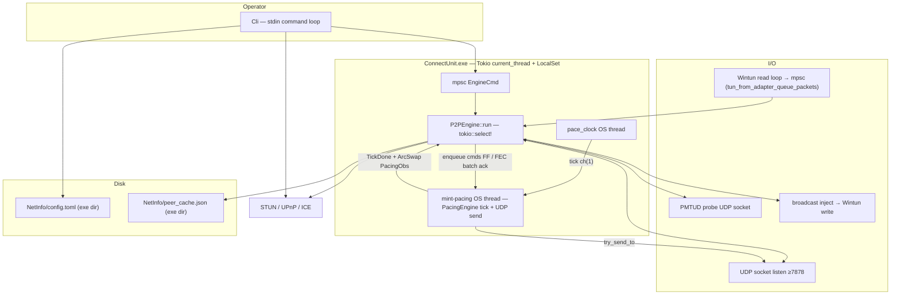

# Mint Spec

Technical reference for **Mint / ConnectUnit**: wire contract, engine behaviour, source layout, and tunable defaults. Orientation for operators: **`README.md`**. Implementation authority: **`src/`**, **`tests/`**, and this document — any wire or behavioural change must update this file and matching tests.

Legend for tuning notes: **↑** = increase value in code/config; **↓** = decrease.

---

## Table of contents

1. [Architecture](#architecture)
2. [Runtime model](#runtime-model)
3. [Source layout](#source-layout)
4. [Startup sequence](#startup-sequence)
5. [Roles: owner vs peer](#roles-owner-vs-peer)
6. [Wire contract](#wire-contract)
7. [Wire protocol (tags)](#wire-protocol-tags)
8. [Data plane path](#data-plane-path)
9. [Control plane path](#control-plane-path)
10. [P2PEngine (core loop)](#p2pengine-core-loop)
11. [Routing and failover](#routing-and-failover)
12. [Cryptography](#cryptography)
13. [Pacing, APD, and pace clock](#pacing-apd-and-pace-clock)
14. [FEC (forward error correction)](#fec-forward-error-correction)
15. [Reliable control transport](#reliable-control-transport)
16. [PMTUD](#pmtud)
17. [NAT, hole punch, and parasitic join](#nat-hole-punch-and-parasitic-join)
18. [TUN / Wintun](#tun--wintun)
19. [Membership sync (MSYN)](#membership-sync-msyn)
20. [Broadcast and relay](#broadcast-and-relay)
21. [CLI commands](#cli-commands)
22. [Persistence](#persistence)
23. [Operational defaults](#operational-defaults-user-tunable)
24. [Performance parameters](#performance-parameters)
25. [Metrics and observability](#metrics-and-observability)
26. [Testing](#testing)
27. [Safety and invariants](#safety-and-invariants)
28. [Quick trace cheatsheet](#quick-trace-cheatsheet)

---

## Architecture



**Central idea:** one **`P2PEngine`** task owns RX, decrypt, routing/session state, and encrypt; a dedicated **`mint-pacing`** OS thread owns **`PacingEngine`** (queues, tick, paced UDP send). The **`Cli`** mutates configuration and sends **`EngineCmd`** messages. **`RoutingTable`** (shared `Arc<RwLock<>>`) maps **virtual IPs (VIP)** to endpoints and path quality. The **owner** allocates VIPs, holds the canonical peer list, and relays traffic when peers cannot talk directly.

---

## Runtime model

| Aspect | Choice |
|--------|--------|
| Async runtime | `#[tokio::main(flavor = "current_thread")]` |
| Concurrency | `tokio::task::LocalSet`: `engine.run()` and `cli.run()` on the same runtime |
| Wintun read | Blocking read on a dedicated thread → `mpsc::Sender<Bytes>` (capacity from `tun_from_adapter_queue_packets`, default 2048) |
| TUN inject | `broadcast::channel` from engine to Wintun writer (size from `tun_inject_queue_packets`) |
| Pacing clock | Separate **OS thread** (`mint-pacing-clock`) → `mpsc` (capacity 1) into **pacing worker** |
| Pacing send | Separate **OS thread** (`mint-pacing`) owns `PacingEngine`; paced `try_send_to`; publishes `PacingObs` / `TickDone` to engine |
| Config reads | `ConfigManager` with `arc_swap` snapshot (lock-free read hot path) |

**Why current_thread:** predictable single-threaded engine logic with explicit `RwLock` on routing. **Pace clock** offloads timer precision (`NtSetTimerResolution` via `windows_timer.rs`); **pacing worker** offloads queue dequeue + UDP send so RX/decrypt on the engine loop is not blocked by paced TX bursts.

---

## Source layout

| Path | Responsibility |
|------|----------------|
| `src/main.rs` | Process wiring: admin check, UDP bind, load cache, spawn engine + CLI, endpoint-cache worker |
| `src/lib.rs` | Crate module exports |
| `src/cli.rs` | Terminal UI, create/join, parasitic LAN join, tuning commands, NAT punch orchestration |
| `src/net/engine.rs` | **`P2PEngine`**: recv loop, TUN egress/ingress, control dispatch, STUN, MSYN, join/kick, FEC/reliable integration; encrypt then hand off to pacing worker |
| `src/net/packet.rs` | 4-byte tag constants, compact types, `frame_with_tag` / `parse_tag` |
| `src/net/pacing.rs` | Send queues, token bucket, DRR, APD drain mode (`PacingEngine` algorithm) |
| `src/net/pacing_worker.rs` | OS thread owning `PacingEngine`: command FIFO, tick, UDP send, `PacingObs` / `TickDone` |
| `src/net/pace_clock.rs` | Pacing tick thread, FAB adaptive tick, `clamp_tick_us` |
| `src/net/fec.rs` | Reed–Solomon encode/decode, adaptive ratios |
| `src/net/reliable.rs` | MREL / MACK state machine |
| `src/net/retransmit.rs` | Direct retransmit bypass rate limiter (`rtrx-s`) |
| `src/net/msyn_sync.rs` | Pure MSYN v3 body builders and sync advance rules |
| `src/net/pmtud_probe.rs` | Separate socket for PMTUD probe traffic |
| `src/net/punch_workflow.rs` | Canonical 3-stage hole-punch workflow |
| `src/routing.rs` | Per-VIP routes, path candidates, failover, tombstones |
| `src/crypto.rs` | AEGIS-128L data + control framing, invites, HKDF derivation, counter anti-replay |
| `src/netinfo.rs` | `NetInfo/` paths next to executable (`config.toml`, `peer_cache.json`) |
| `src/config.rs` | `NetInfo/config.toml` schema, `IPPool` for owner VIP allocation |
| `src/peer_cache.rs` | Serialize/deserialize learned endpoints |
| `src/pmtud.rs` | Path MTU discovery state machine |
| `src/bcast.rs` | Broadcast deduplication (~2s TTL) |
| `src/metrics.rs` | `EngineMetrics` for CLI `runtime` |
| `src/nat/stun.rs` | STUN binding, public endpoint discovery |
| `src/nat/ice.rs` | ICE-style candidates → socket addresses |
| `src/nat/upnp.rs` | UPnP port mapping on create |
| `src/tun/wintun.rs` | Wintun adapter lifecycle and read loop |
| `src/cpu_affinity.rs` | `SetProcessAffinityMask` from config |
| `src/process_priority.rs` | Windows priority class (`prio`) |
| `src/term_style.rs` | ANSI terminal formatting |
| `tests/loopback.rs`, `tests/relay_send.rs` | Integration tests (two engines, relay/TUN paths) |

Largest behavioural surface: `cli.rs` and `net/engine.rs`. Trace bugs from CLI action → `EngineCmd` → engine handler.

---

## Startup sequence

1. **`setup_console_utf8`**, **`ensure_admin`**.
2. Load **`NetInfo/config.toml`** via **`ConfigManager`** (paths from `src/netinfo.rs`).
3. Apply process **priority** and **CPU affinity** from snapshot.
4. Ensure **`wintun.dll`** beside executable (Windows).
5. Bind **UDP** on `max(listen_port, 7878)` with configured snd/rcv buffer sizes.
6. Create empty **`RoutingTable`**. For **peer** role, hydrate **`config.peers`** as Candidate routes (skip self/owner VIP), then hydrate from **`NetInfo/peer_cache.json`**.
7. Start **endpoint cache worker** (debounced ~1s flush of learned endpoints).
8. Create channels: **TUN from adapter** (mpsc, `tun_from_adapter_queue_packets`), **TUN inject** (broadcast, `tun_inject_queue_packets`), **EngineCmd** (mpsc 256).
9. Construct **`P2PEngine`** with initial pacing from config; if role is **owner**, attach **join/leave** handlers and **`IPPool`**.
10. **`LocalSet`**: spawn `engine.run()`, send initial `SetPacing`, then **`cli.run()`** until exit.

---

## Roles: owner vs peer

| | **Owner** | **Peer** |
|---|-----------|----------|
| VIP pool | Allocates new peer VIPs on join | Receives assigned VIP |
| `config.toml` peers | Authoritative peer list | Stores owner endpoint + crypto; joiner roster (FIFO 64) from MSYN |
| Relay | Relays packets for peers on degraded paths | Uses owner (or peer hub) as relay when `should_relay` |
| MSYN | Publishes membership / route sync (coalesced 50ms) | Applies deltas, tracks `membership_version` |
| Parasitic listener | Can accept LAN **parasitic** joins (`MPHI`/`MPHR`, including `discover_only`) | Join via menu: Parasitic Public (VIP) or Parasitic LAN (broadcast discover) |
| Kick | Can **`MKCK`** peer | Clears local session on kick |

---

## Wire contract

- **Authority**: protocol behaviour is defined by this repository (`src/`, `tests/`) and this document. Any wire or behavioural change requires an update here and matching tests.
- **Data plane crypto**: AEGIS-128L with wire frame `0x02 | ctr_le_6 | ciphertext | tag_16`; per-direction HKDF (`data|sender_vip_be|receiver_vip_be`) from the 32-byte network key; nonce is `salt_10 | ctr_le_6`.
- **Control-plane crypto**: AEGIS-128L AEAD; HKDF info `ctrl` (no VIP) from the same network key and salt `mint-aegis-128l-v1`; wire after outer `MCTS` is `ctr_le_6 | ciphertext | tag_16` where plaintext is `inner_tag || body`; AAD is `mcts`; nonce is `salt_10 | ctr_le_6`. Global 48-bit send counter; per-source 128-bit counter replay (`CtrlReplayTable`, max 4096 sources).
- **Wire protocol version**: join `MPJN` / `MPJA` JSON field `proto_ver` must equal **5** (`WIRE_PROTOCOL_VERSION`). Enforced on-wire only; config does not store a protocol version field. Mismatch ⇒ join fails.
- **Packet tags — control plane**: 4-byte ASCII (`M…`): `MPJN`, `MPJA`, `MCTS`, signaling, PMTU, MSYN family, etc.
- **Packet tags — data / reliable plane**: 1-byte compact type (`0x01` data, `0x02` encrypted, `0x03` FEC, `0x04` reliable, `0x05` ack, `0x06` inner JoinAck inside reliable). Reserved: `0x00`, `0x07`–`0xF9` unassigned, `0xFA`–`0xFE` reserved, `0xFF` sentinel. First byte `b'M'` ⇒ 4-byte control tag; otherwise compact parse.
- **Control-sign wrapper tag**: `MCTS`.
- **Invite**: 40-byte payload (mode + IPv4 + port + protocol + key), URL-safe base64 (no padding).
- **Decentralized join (discovery)**: BitTorrent-style trackers keyed by `room_id` (20-byte info hash) = first 20 bytes of `SHA-256(network_key || protocol_byte)` (`PROTO_UDP` = 1). **UDP (BEP15)**: `connect` / `announce` on the engine UDP socket. **HTTP (BEP3)**: GET announce on a separate TCP connection; request uses the same `info_hash`, `peer_id`, and **`port`** (public UDP port from STUN when known, else listen port). Responses must use **compact** `peers`; results merge into the same `discovered` set as UDP. **`decentralized_trackers`** entries: `udp://…`, `http://…`, and `https://…` (HTTPS parsed and retained; TLS announce not implemented — slots skipped). Empty config → built-in mixed UDP/HTTP list. Peers punch discovered endpoints; joiners fan out `MPJN`; only the owner answers `MPJA`. New members still require the owner online. User-visible join success requires CLI profile + `CommandLoop` (not engine-only MPJA). Config: `decentralized_enabled`, `decentralized_trackers`, `decentralized_announce_secs` (default 120), `decentralized_join_deadline_secs` (default 120, single MPJA wait aligned with punch), `join_method`.
- **Peer rediscovery (joiner, tracker)**: Separate from owner reconnect fastpath. Runs only when decentralized is active, not in join wait, network crypto is set, and the owner send route is **missing** or **not hop-usable**; healthy owner suppresses peer reconnect and stops `peer-reconnect:*` workflows. **MSYN** apply also stops all `peer-reconnect:*` keys. Per announce: skip owner send endpoint, consider at most **8** peer addrs, at most **4** distinct `peer-reconnect:` punch keys (same-key respawn allowed), **30s** cooldown per VIP / `unbound` recorded only on successful spawn. Unique public IP → `peer-reconnect:{vip}`; otherwise `peer-reconnect:unbound`. Punch targets are announce candidates (no Active `filter_decentralized_punch_targets`). Learn via existing signed `HPCH`/`HACK` rules (no Active→Candidate demote). Joiner **roster** in `config.peers`: MSYN-driven dirty VIP upsert, FIFO **64** (`name` = `node_id`); remove on MSYN `removed[]`, phantom full sync, MSMD leave — not on `stale_evict`. Boot: roster → Candidate routes, then `peer_cache.json` overlay. Owner roster unchanged (UI lists up to **253** peers). Same-endpoint dead peer: out of scope.
- **Runtime model**: Tokio single-task engine loop + blocking Wintun reader bridge.
- **Reliability**: no `panic!` / `unreachable!` / `unwrap()` on user or network input paths; fixed-size crypto may use `expect` only when the contract is type-level (e.g. 32-byte key into a MAC of matching size).

Legend for tuning notes below: **↑** = increase value in code/config; **↓** = decrease.

---

## Wire protocol (tags)

Code tags: `src/net/packet.rs`. Join handshake requires `proto_ver: 5` in `MPJN` / `MPJA`.

| Tag | Role |
|-----|------|
| Compact `0x01` / `0x02` | IP payload (plain / encrypted) |
| `MKPL` / `MHOL` / `MHAC` | Keepalive / hole-punch / hole-punch ack |
| `MPNG` / `MPON` | Ping / pong (RTT, heal) |
| `MPJN` / `MPJA` | Join request / ack |
| `MPRX` | Proxy/relay wrapper |
| `MKCK` | Kick |
| `MSYN` | Membership / route sync |
| Compact `0x04` / `0x05` | Reliable control send / ack (inner `0x06` = JoinAck JSON) |
| `MPMT` / `MPAR` | PMTU probe / ack |
| Compact `0x03` | FEC shard |
| `MSMD` / `MSSR` / `MSSP` / `MSTR` / `MERR` / `MBRK` / `MRDY` | Sync/metadata/error/break/ready |
| `MCTS` | Signed control wrapper |
| `MPHI` / `MPHR` / `MPHO` / `MPPA` | Parasitic hello / reply / ok / punch ack |
| `HPCH` / `HACK` | Authenticated hole-punch learn (peer rediscovery) |

Parasitic and some engine paths use JSON bodies inside signed or plain control flows — see `engine.rs` and `cli.rs`.

---

## Data plane path

**Egress (TUN → Internet):**

1. Wintun read loop pushes raw IP frame bytes to engine.
2. `handle_tun_packet` parses **destination IPv4** (bytes 16–19).
3. If dest is **local VIP** → inject back to TUN (local delivery).
4. If dest is **peer VIP** → `RoutingTable::lookup_by_vip_u32` → choose endpoint (direct, multipath, or **relay** via `should_relay` / `select_relay_endpoint`).
5. If **broadcast/multicast** → `BroadcastDeduplicator` then fan-out to non-stale endpoints.
6. Encrypt (or frame plain), optional **FEC encoder** per destination, then hand off wire bytes to the **pacing worker** (unless `rawperf-on`, which may `try_send_to` directly from the engine). Data/control/retransmit enqueue is fire-and-forget; FEC shard batches use an ack for all-or-nothing enqueue.

**Ingress (Internet → TUN):**

1. `recv_from` → parse tag → decrypt / FEC reassemble → update routing RTT/loss/bandwidth samples.
2. Deliver to local TUN via **inject broadcast** or relay onward if this node is owner/hop and packet is for another VIP.

User-tunable data-path knobs: edit `NetInfo/config.toml`, then `config reload` — see [Operational defaults](#operational-defaults-user-tunable).

---

## Control plane path

1. UDP datagram → if STUN-shaped, handled separately.
2. Compact reliable / ack → `ReliableChannel` (ordered retry, RTO EWMA).
3. **`MPMT` / `MPAR`** → PMTUD state (+ probe socket for some paths).
4. **`MCTS`** → AEGIS-128L open + per-source counter replay → `dispatch_control` (join, sync, kick, para signals, etc.).
5. Rate limiters protect join and plain control floods.

Control messages update **`RoutingTable`**, **`CryptoPool`**, session identity, and CLI-visible state (via oneshot replies on some `EngineCmd`).

---

## P2PEngine (core loop)

`P2PEngine::run` is a **`select!`** loop over:

- Main **UDP** socket
- **PMTUD probe** socket
- **TUN** ingress channel
- **`EngineCmd`** from CLI
- **STUN DNS resolve** completions
- Periodic **intervals**: peer keepalive, MSYN, direct route retry, PMTUD batch, stale mark/evict, RX bandwidth flush, STUN poll/keepalive, ping watchdog, CC probe (periods from config — see [Performance parameters](#performance-parameters))
- **Pacing `TickDone`** events from the pacing worker (FEC flush, reliable tick, heal on socket-dead)

Important internal state (non-exhaustive):

- `PacingWorkerHandle` (commands / `PacingObs` / events), `ReliableChannel`, `RetransmitDirectSender`
- `fec_send_by_dest` / `fec_decoders`
- `PathMtuDiscovery`, `BroadcastDeduplicator`, `CtrlReplayTable`
- `CryptoPool`, feature flags (multipath, dual-write, predictive heal, control path race, …)
- `peer_sync_state`, `peer_pending_removals`, `msyn_applied_to_rev`
- STUN query maps, pending pings/heal cooldowns, parasitic notify channels

**Session reset** (e.g. after kick): clears routing, crypto, reliable, FEC, dedup, restarts pace-clock + pacing worker.

`EngineCmd` variants (CLI → engine) include: `SetPacing`, `SetCryptoKey`, `PrepareJoin` / `SendJoin`, `ManualPunch`, `SetPeerKeepalive`, `SetFecEnabled`, `SetRawPerf`, `Kick`, `Shutdown`, and more — see `src/net/engine.rs`.

---

## Routing and failover

**`RoutingTable`** maps each **VIP** to a **`RouteEntry`** with:

- Multiple **`PathCandidate`** records: `Direct`, `OwnerRelay`, `IceSrflx`
- EWMA: RTT, loss, bandwidth; **`quality_score`**; state `Candidate` / `Active` / `Degraded` / `Stale`
- Optional delay telemetry: **`rtt_base_ms`** (windowed min-RTT) and **`queuing_delay_ms`** (`max(0, smoothed_rtt − base)`) — fed by periodic **`MPNG`** probes (`probe_interval_ms`, default **20**; **0** = off); used by the FEC loss classifier and **Background CC (LEDBAT)** when `congestion_enabled = true` (default **on**). VIP-level delay updates only from the **active** multipath endpoint; secondary-path samples stay path-local.
- **Control path race** (default on with multipath): recovery **`MHOL`** (`direct_retry`) and predictive **heal `MPNG`** fan out to up to **3** live `PathSet` endpoints in parallel. Periodic CC `MPNG` probes stay single-endpoint.
- **Tombstones** when peers leave (revision counters for MSYN)

Functions **`should_relay`** / **`can_return_to_direct`** implement policy (reading live `FailoverTuning` on the `RoutingTable`); engine calls them when sending TUN and when processing received traffic.

**`peer_cache.json`** stores last-known endpoints per VIP; engine learns endpoints on traffic and via `EndpointLearned` handler.


### Failover defaults

Defaults live in `src/routing.rs` (`failover` module) and are mirrored under the **`[failover]`** table in `config.toml` (e.g. `d2r_quality_min`). Apply with **`config reload`**. Omitting keys keeps defaults.

| Constant / field | Value | Meaning | If ↑ | If ↓ |
|----------|------:|---------|------|------|
| `D2R_QUALITY_MIN` / `d2r_quality_min` | 35 | Minimum quality to stay “healthy” on direct path; below → degraded / relay sooner | Harder to trigger relay; may keep bad direct paths longer | Relay kicks in sooner; more multipath traffic |
| `D2R_LOSS_MAX` / `d2r_loss_max` | 0.12 | Loss EWMA ceiling before treating path as relay-worthy | Tolerates more loss before relay | Stricter; relay on moderate loss |
| `D2R_JITTER_MAX` / `d2r_jitter_max` | 50.0 | EWMA `\|RTT − smoothed_RTT\|` (ms) ceiling before relay; `0` = hair-trigger | Tolerates more RTT variance before relay | Stricter; relay on moderate jitter |
| `R2D_QUALITY_MIN` / `r2d_quality_min` | 50 | Quality required before allowing return to direct | Stricter return; longer relay | Easier flip-flop back to direct |
| `R2D_SUCCESS_MIN` / `r2d_success_min` | 3 | Consecutive success samples needed to return direct (and hold-down clear uses ×2 on RTT path) | More stable return; slower leave relay | Faster return; risk of oscillation |
| `HOLD_DOWN_SECS` / `hold_down_secs` | 2 | After failover to relay, block immediate flip back to direct | Less route flapping; slower recovery to direct | Faster direct retry; more flapping risk |

- Degraded → relay: quality below `D2R_QUALITY_MIN`, state degraded/stale, `loss_ewma` above `D2R_LOSS_MAX`, or `jitter_ms` above `D2R_JITTER_MAX`.
- Data-plane relay hop: `select_relay_endpoint` prefers owner when hop-usable; otherwise one usable peer hub (one-hop MDAT; forward to dest direct ep only). Peer relay does not apply until the owner route already fails hop-usable.
- Return to direct: quality ≥ `R2D_QUALITY_MIN`, `success_streak` ≥ `R2D_SUCCESS_MIN`, hold-down elapsed.


---

## Cryptography

- **`MintCrypto`**: encrypt/decrypt with random nonce per message.
- **`AeadKey`**: cached cipher + monotonic nonce suffix for high-volume sends.
- **`CryptoPool`**: network key + per-peer bindings + limited extra keys.
- **Control AEAD**: `MCTS` wrapper; AEGIS-128L with HKDF `ctrl`; encrypts inner tag + body; global send counter; `CtrlReplayTable` (4096-source cap).
- **Invites** encode network id, keys, endpoints — decode in CLI for `join`.

**Rule:** no `panic!` / `unwrap()` on user or network input paths.

---

## Pacing, APD, and pace clock

**Goals:** cap transmit rate, bound latency under load, prioritize small control traffic, fair share between peers (DRR).

**Cascade hierarchy (TX):**

1. **Background CC (LEDBAT)** — per-peer byte rate via token bucket (`congestion_enabled`).
2. **Global pacing bucket** — aggregate ceiling (`pace_target_bps` / `pace_target_pps`); peer sends only when CC *and* global budget allow (AND at pop).
3. **APD** — local latency safety (burst ramp / Drain spin), **not** a third rate controller. With `apd_require_cc_headroom` (default **true**), APD does not ramp-up, arm Drain, or stay in Drain while every non-empty data peer is CC-blocked (vacuous: no data peers → gate off so control/retransmit path is unaffected).

| Mechanism | Purpose |
|-----------|---------|
| Token bucket | `pace_target_pps` / `pace_target_bps`, `pace_budget_cap_packets`, burst per tick |
| Queues | Per-peer data queues plus global control/retransmit queues; `pace_max_queue_packets` is the split basis, not a global hard cap |
| DRR | Deficit round-robin across peers (`drr_enabled`) |
| DRR small-packet priority | Optional per-peer lane: frames under `drr_small_packet_threshold_bytes` dequeue before bulk |
| DRR RTT-aware quantum | Optional: scale per-peer DRR quantum by **base RTT** vs median base among active peers |
| APD | High queue fill → Tier-1 burst ramp (`ramp_max_burst`), then drain mode (`drain_max_burst`, faster tick, spin budget, optional DRR freeze); gated by CC headroom when enabled |
| FAB (`pace_fab_enabled`) | After repeated timer overshoots, temporarily longer tick |
| Pace clock thread | Fires ticks into the pacing worker; exposes overshoot metrics to `EngineMetrics` |
| Pacing worker thread | Owns `PacingEngine`; dequeue + paced UDP send; publishes `PacingObs` and `TickDone` |

### Normal pacing

The dedicated pace-clock thread emits ticks to the **`mint-pacing`** worker (not the engine `select!` loop). Each accepted tick runs `PacingEngine::tick` on that worker: refill the token bucket from elapsed wall-clock time, measure queue pressure, ask APD for the effective burst, then `try_send_to` while all of these limits still permit work:

1. the APD/base burst allowance for this tick is not exhausted;
2. at least one token remains in the bucket;
3. the per-tick CPU deadline (`max_tick_work_us`) has not expired; and
4. a packet is available and the UDP socket accepts it.

The engine encrypts (or frames) outbound data, then enqueues wire bytes to the worker via a bounded command channel (capacity **1024**). Ordinary data/control/retransmit commands are fire-and-forget; command-channel full drops **data** only (`pacing_cmd_channel_full`). FEC encoded batches keep a sync ack so all-or-nothing enqueue can fall back to per-packet enqueue. After each tick the worker publishes `PacingObs` (`ArcSwap`) and a `TickDone` event; the engine uses that arm for FEC flush, reliable retransmission scheduling, drop counter sync, and socket-dead heal.

Scheduler packet capacity with defaults:

```text
scheduler_capacity_pps ≈ base_max_burst × 1_000_000 / pace_tick_us
```

With current defaults (`500 µs`, base burst `3`), scheduler capacity is `6,000 pps`. Sustained send rate in bytes mode is capped by `pace_target_bps` (factory **50_000_000** ≈ 400 Mbit/s). `pace_budget_cap_packets=32` allows accumulated credit after idle or delayed ticks; it does not raise the sustained target.

**Token-bucket units:** `pace_budget_cap_packets` is always a packet-unit knob (`1..=4096`), even when `pace_rate_mode=bytes`. In bytes mode the engine refills at `pace_target_bps` (or `pace_target_pps×1300` if `pace_target_bps=0`), charges each send by wire length, and caps the balance at `pace_budget_cap_packets × 1300` bytes — do not put a raw byte count in `pace_budget_cap_packets`.

`pace_max_queue_packets` is a queue **basis** split into a data depth per active peer and global control/retransmit depths. The APD denominator grows with the number of non-empty peer queues.

### APD (Adaptive Pressure Drain) pressure signal and ramp

APD computes one aggregate pressure sample per accepted tick:

```text
fill = clamp(
    (data_queued + control_queued + retransmit_queued) / queue_capacity,
    0,
    1
)
```

Tier 1 converts that fill ratio into a burst target without changing the base `pace_tick_us`:

```text
t = clamp((fill - low_watermark) / (high_watermark - low_watermark), 0, 1)
target_burst = round(base_burst + t × (max_burst - base_burst))
```

Response is asymmetric: rising fill moves burst immediately to the new target; flat/falling fill decreases by at most one packet per tick.

### APD phases

```text
Cooldown ──cooldown elapsed──> Alert
   ▲                              │
   │                              │ ramp pinned at max
   │                              │ + (fill > high OR max HOL sojourn > max)
   │                              │ + confirm ticks satisfied
   │                              ▼
   └──── fill < low or budget ── Drain
```

- **Cooldown:** pure-spin drain cannot re-arm; Tier-1 ramp remains active.
- **Alert:** ramp runs at the normal clock; drain confirmation advances while fill is above `high_watermark` with ramp pinned, or while HOL sojourn exceeds `apd_max_sojourn_ms` when sojourn gate is on.
- **Drain:** pace clock switches to pure spin with `apd_drain_tick_us`, burst held at `drain_max_burst`, optional DRR freeze.

Drain exits when fill falls below `apd_low_watermark` **and** (sojourn gate on) HOL sojourn below `apd_target_sojourn_ms`, when `apd_spinloop_budget_ms` expires, or (when `apd_require_cc_headroom` and background CC is on) when no non-empty data peer is CC-sendable; then Cooldown for `apd_cooldown_ms`.

The faster drain clock does **not** bypass the token bucket. Retransmit priority and control interleaving are preserved during Drain. Optional local-sojourn shedding can drop stale **bulk HOL** packets only when `shed_enabled` and queue fill is above `shed_min_fill`. Under sustained CC starve with headroom gating on, APD spins less often — shed may trim backlog more, and FEC Drain passthrough is rarer (accepted).

Field-level defaults and ↑/↓ semantics: [Operational defaults](#operational-defaults-user-tunable) § Pacing / APD.

---

## FEC (forward error correction)

- **Reed–Solomon** over shards (**1279 B** payload per shard default).
- Encoder per destination; decoder map keyed by source address.
- **Adaptive** parity from loss EWMA (thresholds via `adaptive_off_below` / `adaptive_on_above`) or **forced ratio** via `fec_force_*` fields.
- **Loss classifier** (default **on**): when `loss_classifier_enabled = true`, adaptive FEC will **not increase** parity if `queuing_delay_ms / target_queue_delay_ms` exceeds `congestion_loss_threshold`. Decreasing or turning FEC off still follows loss hysteresis. After delay recovers, a **recovery step-down** may lower parity while loss EWMA is sticky, within `fec_recovery_recency_ms` (default **3000**, **0** = disable step-down only) of the last congestive sample.
- **Background CC (LEDBAT)** (`congestion_enabled`, default **on**): per-peer byte rate via token bucket; delay gradient updates rate from MPNG queuing delay. With `congestion_enabled = false`, pacing CC actuation is off.
- Flush timers **2 ms / 4 ms** (aggressive vs default); small packets may flush immediately. While APD is in **Drain**, timer flush emits **passthrough only** (no parity).
- `shard_payload_size` is a **local send ceiling** (512–1279); at runtime also capped so `12 + shard ≤ min_path_mtu − 28` (IPv4+UDP); below the 512 floor FEC bypasses. Disabled in **`rawperf-on`** mode.

Full congestion / FEC field table: [Operational defaults](#operational-defaults-user-tunable) and [Performance parameters](#performance-parameters).

---

## Reliable control transport

- Compact reliable send / ack (`0x04` / `0x05`) with ordered retry and RTO EWMA.
- Pending cap, RTO min/max, retry count (default `retries_left = 1`) — tunable via `[reliable]` config keys.
- Some retransmits bypass pacing via **`RetransmitDirectSender`** (rate limited by CLI `rtrx-s`).

---

## PMTUD

- **`PathMtuDiscovery`** in engine + **`pmtud_probe`** socket.
- Probe size ladder, stable downgrade batches (tunable via `probe_sizes` / `stable_downgrade_batches`), adapter MTU sync (floor **1220**, default adapter **1340**).
- When `min_path_mtu` changes, the engine retunes/flushes FEC encoders to the path-derived shard ceiling (config `shard_payload_size` is not rewritten).
- CLI `config reload` may apply saved MTU/metric via netsh when a profile is active.

---

## NAT, hole punch, and parasitic join

| Component | Use |
|-----------|-----|
| **UPnP** (`nat/upnp.rs`) | Map listen port on router during **create** |
| **STUN** (`nat/stun.rs`) | Learn public endpoint; cached; keepalive |
| **ICE** (`nat/ice.rs`) | Candidate list → punch target addresses |
| **Manual punch** | CLI `punch` → engine `StartPunchWorkflow` (canonical 3-stage) |

**Decentralized join** (default): paste invite → STUN → tracker announce (public UDP port from STUN, fallback listen port) → punch peers → `MPJN` fan-out → owner `MPJA`. Discovery uses **`decentralized_trackers`** (empty → built-in list; default list front-loads UDP+HTTP dual pairs on the same host:port, then UDP-only trackers):

- **UDP (BEP15)**: `connect` / `announce` on the engine UDP socket.
- **HTTP (BEP3)**: GET announce over TCP; compact peer list merged into the same discovery set as UDP.
- **HTTPS URLs** may appear in the list; announce over TLS is **not implemented** (slots kept but skipped).

UDP and HTTP trackers run in parallel; join uses the same canonical tiered punch as manual/parasitic paths. Owner and existing peers keep announcing for reconnect. Owner must be online to admit **new** members.

**Peer rediscovery (joiner):** After join, peers keep announcing on the tracker. When the **owner route is missing or not hop-usable**, joiners may run a separate **`peer-reconnect:*`** canonical punch toward announced endpoints (budget 8 addrs per announce, max 4 concurrent keys, 30s per-key cooldown). VIP binding uses **unique public IP** only. Routes update via authenticated `HPCH`/`HACK`. While the owner path is healthy, peer reconnect is suppressed; **MSYN** stops in-flight peer reconnect workflows. Joiners persist a **roster** in `config.peers` (FIFO cap **64**, `name` = `node_id`). Boot hydrates roster as **Candidate** routes, then overlays **`peer_cache.json`**. Owner `config.peers` remains authoritative (up to **253** VIPs in the UI).

**Parasitic join**:
- **Public**: VIP unicast signaling over an existing VPN/route + STUN/UPnP + punch (`join_parasitic_with_params`).
- **LAN**: joiner broadcasts `discover_only` **`MPHI`**, collects owner **`MPHR`** (~2.5s), client picks owner (or `ip:port` fallback), then unicasts a real Hello; owner admits with VIP + `network_key_hex`; punch uses private candidates only (no STUN/UPnP). Owner listen port defaults to **7878**. Config: `parasitic_enabled`, `parasitic_use_public`.

Canonical punch stages and `PARA_*` constants: [Performance parameters](#performance-parameters) § Punch / NAT.

---

## TUN / Wintun

- DLL: **`wintun.dll`** next to executable.
- Adapter name safe-checked; IPv4 address + prefix from config (**`subnet_prefix`**, default /24).
- Ring size **`wintun_ring_bytes`**; interface metric **`wintun_ipv4_interface_metric`** (lower = more preferred route on Windows).
- Read loop (blocking) → engine; inject path ← engine **`broadcast`**.

---

## Membership sync (MSYN)

- Periodic and event-driven **route/membership** sync using **`MSYN`** (v3 delta/full bodies built in `msyn_sync.rs`).
- Owner increments **`membership_version`**; peers track **`msyn_applied_to_rev`** and **`peer_sync_state`**.
- Removals use **tombstone revisions**; **`peer_pending_removals`** ensures peers learn departures before sync cursor advances.
- Related: **`MSMD`** dedup, **`MSSP` / `MSSR`** snapshots (limits in [Performance parameters](#performance-parameters)).

---

## Broadcast and relay

- **Broadcast/multicast** IP on TUN: dedup with **`BroadcastDeduplicator`** (hash of prefix of packet + scope), then send to all non-stale peer endpoints. Peers that need relay get one aggregated copy to a **relay hop** (prefer owner when hop-usable, else best peer hub).
- **Relay:** when `should_relay` applies, non-owners pick a **one-hop relay** via `RoutingTable::select_relay_endpoint` (prefer owner; peer hub when owner route is already unusable). The hop forwards by inner destination VIP to the peer’s **direct** endpoint only (no relay-of-relay). Owner still forwards using its routing table (`MPRX` / relay logic in engine).
- **Limit:** peer relay failover requires the owner route to already fail hop-usable; it does not replace owner rediscovery after endpoint drift.
- Engine helpers: **`should_relay`**, **`is_broadcast_or_multicast`**, **`select_relay_endpoint`**.

---

## CLI commands

Interactive loop after session restore (`?` = help):

| Command | Description |
|---------|-------------|
| First-run `[1]` Create | New network (owner): name, port, VIP, subnet, UPnP, STUN, invites (idle only) |
| First-run `[2]` Join | Join via wizard: decentralized (default), parasitic, or manual — not while a profile is active (`remove` first) |
| First-run `[3]` / `stop` / `exit` | Shut down VPN daemon and quit client |
| `list` | Peers and routes |
| `runtime` | Live dashboard: counters, VPN byte rates, pacing/UDP/TUN buffers (1s; Enter to stop) |
| `ping` | Latency to peers |
| `kick` | Disconnect peer (owner) |
| `remove` | Remove peer from config |
| `stun` | Query public endpoint |
| `punch` | Manual hole punch to host:port |
| `config show` / `config reload` / `config reset` | Performance via `NetInfo/config.toml` (show, merge from disk + apply live, factory reset) |
| `autoclear-on` / `autoclear-off` | Toggle clearing the terminal before each command (default: on) |
| `stop` | Exit (disconnect VPN and quit) |

First-run **`AppState::FirstRun`** menu runs before **`CommandLoop`**.

---

## Persistence

| File | Role |
|------|------|
| `NetInfo/config.toml` (next to `ConnectUnit.exe`) | Full `NetworkConfig`: identity/session, peers, invites, parasitic state, buffers, MTU/metric, pacing/APD/DRR/FEC runtime knobs, decentralized join, and engine tuning keys (sectioned TOML tables: `[session]`, `[pacing]`, `[apd]`, `[drr]`, `[fec]`, `[congestion]`, `[failover]`, …) |
| `NetInfo/peer_cache.json` (next to `ConnectUnit.exe`) | Learned endpoints (maintained by engine; not normal hand-edit) |

### Identity / session fields (not applied by `config reload`)

These are written by create/join/leave flows. Changing them by hand requires a **daemon restart** (reload merges performance fields only).

| Field | Factory default | Meaning |
|-------|----------------:|---------|
| `server_name` | `""` | Display name for this node |
| `network_id` | `""` | Network / room id (hex) |
| `role` | `""` | `"owner"` or `"peer"` once joined |
| `virtual_ip` | `""` | This node’s VIP |
| `owner_real_ip` / `owner_port` | `""` / `0` | Owner’s known real endpoint |
| `listen_port` | `0` | Saved bind preference; effective = `max(saved, 7878)` |
| `node_id` | `""` | Local node id (hex) |
| `crypto_key` | `""` | Network key (hex) |
| `public_invite_code` | `""` | Single invite blob (mode=1; STUN endpoint or local IP:port fallback) |
| `parasitic_enabled` | `false` | Parasitic join mode active |
| `parasitic_peer_vip` / `parasitic_self_vip` | `""` | Parasitic signal peer / self |
| `parasitic_peer_port` | `0` | Peer signal port in parasitic mode |
| `parasitic_peer_node_id` | `""` | Peer node id in parasitic mode |
| `parasitic_self_is_owner` | `false` | Local side is parasitic owner |
| `parasitic_use_public` | `true` | `true` = Public parasitic (STUN/UPnP); `false` = LAN parasitic |
| `peers` | `[]` | Authoritative peer list (`node_id`, `name`, `virtual_ip`, `real_ip`) |
| `owner_endpoints_cache` | `[]` | Cached owner endpoints |
| `membership_version` / `last_membership_hash` | `0` / `""` | Membership revision + hash |
| `created_at` | `0` | Profile create epoch (ms) |
| `decentralized_enabled` | `false` | Tracker announce / decentralized path on |
| `decentralized_trackers` | `[]` | Empty ⇒ built-in `DEFAULT_TRACKERS` list |
| `decentralized_announce_secs` | `120` | Tracker re-announce interval (min effective 60 s) |
| `decentralized_join_deadline_secs` | `120` | Join wait for `MPJA` / punch alignment |
| `join_method` | `""` | e.g. `"decentralized"`, `"parasitic"`, `"manual"` after wizard |

## Operational defaults (user-tunable)

Factory defaults below match `NetworkConfig::default` / `pacing_defaults` / `AdvancedTuning::default` (same values a fresh profile gets for performance fields).

### Listen and membership

| Item | Default | Meaning | If ↑ | If ↓ |
|------|--------:|---------|------|------|
| Effective listen port | max(saved, **7878**) | UDP bind port for P2P | More collision risk with other apps if arbitrary; 7878 is product default | — |
| `MAX_PEERS` (UI) | **253** | Display cap only | — | — |
| `subnet_prefix` | **24** | VPN IPv4 subnet size | Smaller LAN (fewer VIPs) | Larger LAN |

### MTU and PMTUD

| Item | Default | Meaning | If ↑ | If ↓ |
|------|--------:|---------|------|------|
| `adapter_mtu` | **1340** | Wintun interface MTU (payload limit per frame on TAP) | Larger packets per datagram; more fragmentation risk on Internet path if PMTUD lags | Smaller frames; safer on lossy paths; more overhead |
| PMTUD floor | **1220** | Minimum path MTU used when discovery incomplete | — | — |

### Advanced tuning (sectioned tables in config.toml)

Failover thresholds, engine timers, reliable RTO/retry bounds, FEC shard size + flush + adaptive thresholds + max total shards, PMTUD probe ladder, congestion telemetry / FEC loss classifier, routing EWMA / quality scoring, engine per-tick / STUN / MSYN limits, and canonical hole-punch stage knobs live in dedicated TOML tables (`[failover]`, `[timers]`, `[reliable]`, `[fec]`, `[congestion]`, `[pmtud]`, `[routing_ewma]`, `[engine_limits]`, `[hole_punch]`, `[buffers]`) — see [Performance parameters](#performance-parameters) for the full schema, clamps, and semantics. Defaults match the engine constants; omitting keys preserves today's behavior. Apply live with **`config reload`** (performance merge includes these fields); **`config reset`** also clears them. In-flight hole-punch workflows keep the snapshot from spawn; the next punch uses reloaded values.

### UDP and Wintun (`buffer`)

| Field | Default | Meaning | If ↑ | If ↓ |
|-------|--------:|---------|------|------|
| `udp_sndbuf` | 256 KiB (`262144`) | OS send socket queue bytes | Absorbs bursts without drop; more RAM | Drops under burst; lower RAM; less send-side bufferbloat |
| `udp_rcvbuf` | 2 MiB (`2097152`) | OS receive socket queue bytes | Absorbs inbound bursts; more RAM | Drops under burst; lower RAM |
| `wintun_ring_bytes` | 4 MiB (`4194304`) | Wintun ring between kernel driver and reader | Fewer drops when engine busy; more RAM | Reader may lag; TUN backpressure |
| `wintun_ipv4_interface_metric` | 1 | Windows route preference for VPN NIC (lower = preferred) | VPN less preferred vs other interfaces | VPN more preferred |

### Pacing (`pace`)

Scheduler capacity (packets/s) is approximately `base_max_burst × (1_000_000 / pace_tick_us)`. Token-bucket refill and balance units follow `pace_rate_mode`:

- `"pps"`: refill at `pace_target_pps`; balance capped at `pace_budget_cap_packets` (tokens = packets).
- `"bytes"` (default): refill at `pace_target_bps` (or `pace_target_pps×1300` when `pace_target_bps` is **0**); consume `pkt_len` per send; balance capped at **`pace_budget_cap_packets × 1300`** bytes.

`pace_budget_cap_packets` is **always** configured in packet units (`1..=4096`), never as raw bytes. Do not enter a byte count when using `pace_rate_mode=bytes` — the engine applies the ×1300 scale at runtime.

| Field | Default | Meaning | If ↑ | If ↓ |
|-------|--------:|---------|------|------|
| `pace_tick_us` | 500 | Engine send scheduler period | Slower tick → lower CPU, higher queue latency | Faster tick → lower latency, higher CPU |
| `pace_target_pps` | 10000 | Token refill rate when `pace_rate_mode=pps` (packets/s) | Higher throughput ceiling; more bandwidth | Lower cap; may queue or drop |
| `pace_rate_mode` | `"bytes"` | Global bucket units: `"pps"` or `"bytes"` | `bytes`: refill/consume/cap in bandwidth units | Packet-count bucket |
| `pace_target_bps` | `50000000` (~400 Mbit/s) | Refill rate when `pace_rate_mode=bytes` (**0** = derived from `pace_target_pps×1300`) | Higher byte/s ceiling | Lower bandwidth cap |
| `base_max_burst` | 3 | Base max sends per tick (also APD ramp floor) | Bigger micro-bursts; jitter on wire | Smoother; may underuse link |
| `pace_budget_cap_packets` | 32 | Max token-bucket balance in **packet units** (bytes mode: effective cap = value×1300) | Allows longer bursts after idle | Tighter burst control |
| `pace_max_queue_packets` | 128 | Queue **basis** (splits into per-peer data cap + global control/retransmit caps) | More buffering per peer; higher latency under load | Earlier drop; lower delay |
| `pace_clock_mode` | `"hybrid"` | `""`/`auto`/`hybrid`: use `pace_spin_window_us`; `"spin"`: force spin window; `"hr"`: hybrid HR sleep (`spin_window=0`) | — | — |
| `pace_spin_window_us` | 50 | Busy-wait within tick before sleep | Lower timer jitter; more CPU | Less CPU; coarser timing |
| `pace_fab_enabled` | false | Lengthen tick after repeated overshoots | On: recovers from backlog spikes; tick less stable | Off: steady tick only |
| `pace_fab_fallback_tick_us` | 700 | Tick used during FAB recovery | Slower drain during overload; less CPU | Faster FAB ticks; more CPU |
| `tun_inject_queue_packets` | 512 | Broadcast channel for inject to TUN reader | Survives spikes from engine to adapter | Drops/lag on inject burst |
| `tun_from_adapter_queue_packets` | 2048 | mpsc capacity Wintun reader → engine (**startup-only**) | Absorbs TUN bursts before adapter ring fills | Earlier reader block; drops from adapter sooner |

| Session | Default | Meaning | If ↑ | If ↓ |
|---------|--------:|---------|------|------|
| `drr_enabled` | true | Deficit round-robin across peers/queues | Fairer mix; slightly more CPU | FIFO-like; one peer can starve others |
| `drr_small_packet_priority` | true | Prefer sub-threshold data packets per peer before bulk | Lower latency for small tunnel frames | Strict enqueue FIFO within peer |
| `drr_small_packet_threshold_bytes` | 450 | Max length (bytes) for small-packet lane (**64–512**) | Larger frames count as “small” | Only smaller frames get priority |
| `drr_rtt_aware` | true | Scale per-peer DRR quantum by **base RTT** (`rtt_base_ms`) vs median base among non-empty peers; missing base → no scale for that peer | High-base-RTT peers get larger byte slices per round | Fixed `drr_quantum` for all peers |
| `drr_rtt_scale_min` | 0.5 | Lower clamp on RTT/ref ratio (**0.1–1.0**) | Low-RTT peers may get smaller quantum | Less differentiation for fast peers |
| `drr_rtt_scale_max` | 2.5 | Upper clamp on RTT/ref ratio (**1.0–4.0**) | High-RTT peers may get larger quantum | Less compensation for slow peers |
| `min_control_reserved_bytes_per_tick` | 200 | Per-tick byte budget reserved for control before bulk (`0` = off; clamp ≤8192) | Control less starved under load | More bytes available for data |
| `min_retransmit_reserved_bytes_per_tick` | 200 | Per-tick byte budget reserved for retransmit prefix (`0` = off; clamp ≤8192) | MREL retries less starved | More bytes available for data |
| `drr_quantum` | 1500 (code) | Bytes of “deficit” per scheduling round | Larger peer slices per turn | Finer fairness; more scheduler overhead |
| `max_tick_work_us` | 150 (code) | CPU time cap per pacing tick on the **pacing worker** | More work per tick; can delay the next paced send burst | Stricter cap; may leave work queued |

### APD (configured via `pace`)

Tier 1: linear burst ramp between watermarks (same base tick), ceiling `ramp_max_burst`. Tier 2: pure-spin drain when ramp is pinned at `ramp_max_burst` and (**fill** above `apd_high_watermark` **or** HOL sojourn above `apd_max_sojourn_ms` when `apd_sojourn_enabled`) for `apd_confirm_ticks`; drain uses `drain_max_burst`. Exit drain when fill below `apd_low_watermark` **and** HOL sojourn below `apd_target_sojourn_ms` (sojourn gate on), spin budget expires, or CC headroom is lost while `apd_require_cc_headroom` is on.

When `apd_require_cc_headroom` is **true** and `congestion_enabled` is on, APD does not increase/pin the ramp, does not arm Drain, and early-exits Drain unless at least one non-empty data peer HOL passes `can_send_data` (tokens or `hol_escape_ms`). No non-empty data peers → gate does not apply (control/retransmit-only pressure still uses APD). Recommended: keep `hol_escape_ms ≤ apd_max_sojourn_ms` so sojourn-arm can fire soon after HOL escape under CC starve (not enforced).

| Field | Default | Meaning | If ↑ | If ↓ |
|-------|--------:|---------|------|------|
| `apd_enabled` | true | Queue-pressure ramp + drain | On: fights backlog | Off: pacing only |
| `apd_high_watermark` | 0.6 | Queue fill ratio for ramp upper bound / drain arm (user range **0.2–0.95**; must be ≥ low + **0.1** unless cap mode) | Triggers later; less aggressive drain | Triggers sooner; more drain episodes |
| `apd_low_watermark` | 0.1 | Fill ratio to exit drain (user range **0.1–0.8**) | Stays in drain longer | Exits drain sooner; queue may refill |
| `apd_sojourn_enabled` | true | Dual-gate drain arm/exit via HOL sojourn | Catches stale packets when fill is low | Fill-only arm/exit |
| `apd_max_sojourn_ms` | 6 | Arm drain when HOL age exceeds this (ms, **2–500**) | Less sensitive to latency | Arms drain sooner on old HOL |
| `apd_target_sojourn_ms` | 2 | Exit drain only when HOL age below this (ms, **1–200**, must be &lt; max − 2) | Exit drain sooner | Hold drain until queue is fresher |
| `apd_require_cc_headroom` | **true** | Gate APD ramp-up / Drain arm / mid-Drain on data CC sendability | On: no false Drain/spin while CC starves all data HOL | Off: APD reacts to fill/sojourn even when CC blocks pops |
| `ramp_max_burst` | 8 | **Absolute** max packets/tick for Tier-1 ramp ceiling (must be ≥ `base_max_burst`) | Faster ramp; bigger wire bursts in Alert | Slower ramp; smoother |
| `drain_max_burst` | 2 | Max packets/tick during Tier-2 drain (≤ `ramp_max_burst`) | Faster drain micro-bursts | Gentler on upstream routers |
| `apd_spinloop_budget_ms` | 4 | Max pure-spin time per drain episode (user **0–100** ms; **`0` = unlimited** until fill &lt; low WM) | Longer spin cap; more CPU | Shorter cap; may exit drain before queue empties |
| `apd_drain_tick_us` | 50 | Pacing tick override in drain (`0` = base tick) | Faster drain loop | Slower drain |
| `apd_confirm_ticks` | 2 | Ticks with ramp pinned and fill above high WM before drain (user **0–10**; **`0` = no confirm**) | Less false drain | More false positives |
| `apd_cooldown_ms` | 2 | Min time after drain before re-arming spin (ramp continues) | Fewer drain oscillations | Can re-enter drain spin quickly |
| `apd_drain_freeze_drr` | true | Round-robin (not byte-deficit DRR) while draining | Prioritizes emptying queue | DRR continues; mixed fairness |

**Watermark UX (`pace` interactive, APD on):** prompts low then high, then `ramp_max_burst`, then `base_max_burst` (must be &lt; ramp), then `drain_max_burst` (must be &lt; ramp). If `apd_high_watermark == apd_low_watermark` (**cap mode**), both act as one queue-fill cap: drain arms when fill **>** cap (after `apd_confirm_ticks`), exits when fill **<** cap. Otherwise hysteresis: high ≥ low + 0.1.

### Local-sojourn shedding (bulk lane only)

When enabled, pacing may proactively drop stale **bulk** HOL packets before the send loop. This is local queue age only (no RTT/OWD term), and is gated by queue fill to avoid shedding at low pressure.

| Field | Default | Meaning | If ↑ | If ↓ |
|-------|--------:|---------|------|------|
| `shed_enabled` | true | Enable bulk HOL stale shedding | Backlog pressure can be trimmed earlier | No proactive stale bulk drop |
| `shed_max_sojourn_ms` | 50 | Drop bulk HOL older than this (**2–500** ms) | More tolerant to queue age | Drops stale bulk sooner |
| `shed_min_fill` | 0.2 | Shedding gate: require fill ≥ this (**0.1–0.95**) | Shedding activates only under heavier fill | Can shed earlier under moderate fill |
| `shed_max_per_tick` | 2 | Per-tick cap on stale bulk drops (**1–64**) | Faster stale-bulk cleanup in one tick | Smaller per-tick shedding work |

Sanitize rule: when `shed_enabled && apd_enabled && apd_sojourn_enabled`, `shed_max_sojourn_ms` is clamped to be at least `apd_max_sojourn_ms` so APD drain gets first chance before stale-bulk shedding.

### FEC (`fec-on` / `fec-s`)

| Item | Meaning | If ↑ / on | If ↓ / off |
|------|---------|-----------|------------|
| `fec_enabled` | Reed–Solomon groups on data path | Better recovery on loss; more bandwidth/CPU | Less overhead; loss hurts more |
| Forced `fec-s` ratio | Fixed data/parity shards | More parity → more recovery, more overhead | Adaptive only: follows loss EWMA |
| Adaptive thresholds (`advanced.fec`) | Loss % → shard layout | Earlier FEC on | Later FEC on / easier off |
| Loss classifier (`advanced.congestion`) | Hold parity **increases** when queuing delay ratio is high; after delay recovers, optional one-step parity **step-down** if congestion was recent | On: avoids pumping parity into bufferbloat; sheds sticky FEC sooner post-bloat | Off: loss-only adaptive FEC |

Shard **1279** B, flush **2/4 ms**: larger shards = fewer headers; longer flush = better grouping, higher latency.

### Congestion telemetry / FEC classifier (`advanced.congestion`)

Tracks base RTT and queuing delay on each `RouteEntry`. Optional gate on adaptive FEC parity increases. **Background CC (LEDBAT)** per-peer byte rate control in pacing when `congestion_enabled` is **true** (default).

| Field | Default | Meaning | If ↑ / on | If ↓ / off |
|-------|--------:|---------|-----------|------------|
| `congestion_enabled` | **true** | LEDBAT background CC (token bucket + delay gradient) | On: per-peer rate limits from queuing delay | Off: telemetry/FEC only; no pacing CC actuation |
| `gain` | 0.35 | Multiplicative decrease when `queuing_delay / target > 1` (**0.1–4.0**) | Drops peer rate faster under delay | Gentler decrease |
| `hol_escape_ms` | 5 | Send despite empty tokens when peer HOL sojourn ≥ this (**4–100**); recommend ≤ `apd_max_sojourn_ms` when `apd_require_cc_headroom` is on | Escape starvation sooner | Longer throttle under backlog |
| `initial_rate_bps` | 8M | New peer starting rate (**≤ max_rate_bps**) | Higher cold-start send cap | Lower initial cap |
| `additive_increase_bps` | 48000 | Linear increase per probe when delay ≤ target (**4000–1e6**) | Faster headroom use | Slower ramp |
| `min_decrease_factor` | 0.85 | Floor on one multiplicative decrease step (**0.1–0.9**) | Shallower single-step cuts | Deeper cuts |
| `rate_smoothing_alpha` | 0.8 | EWMA on applied rate (**0–0.95**) | Smoother rates | Faster response |
| `min_rate_bps` / `max_rate_bps` | 1.5M / 20M | Absolute per-peer rate clamps | Wider/narrower range | Tighter caps |
| `loss_multiplicative_decrease` | 0.85 | On rising `loss_ewma` past failover threshold (**0.3–0.9**) | Stronger loss reaction | Weaker loss reaction |
| `burst_cap_bytes` | 16000 | Per-peer token burst cap (**512–262144**) | Larger micro-bursts | Tighter pacing |
| `rtt_base_tracking` | true | Update `rtt_base_ms` / `queuing_delay_ms` on RTT samples | On: delay telemetry available | Off: skip base updates (`queuing_delay` stays 0) |
| `loss_classifier_enabled` | **true** | Gate adaptive FEC increases by delay ratio; enable post-congestion recovery step-down | On: hold parity up under congestion; step down after QD recovers (see `fec_recovery_recency_ms`) | Off: loss-only adaptive FEC |
| `target_queue_delay_ms` | 10 | Denominator for `delay_ratio` (**10–150**) | Higher → less likely to classify as congestive | Lower → hold FEC increases sooner |
| `congestion_loss_threshold` | 0.7 | Hold increase / mark congestive when `queuing_delay / target >` this (**0.3–0.95**); recovery uses the same threshold for “delay recovered” | More tolerant of delay before hold | Holds sooner |
| `base_rtt_window_secs` | 3 | Min-RTT window length (**1–60**) | Slower base adaptation | Faster base churn |
| `base_rtt_stale_windows` | 2 | Consecutive windows before base may **rise** (**1–10**) | Base rises only after more confirmation | Base rises sooner when path worsens |
| `probe_interval_ms` | 20 | Periodic `MPNG`/`MPON` for RTT samples (**0** = off, else **20–1000**) | Fresher queuing-delay telemetry | Less control traffic; sparser RTT |
| `fec_recovery_recency_ms` | **3000** | After last congestive sample, how long recovery may step parity down one ladder rung (**0** = off; else **100–60000**) | Longer sticky post-bloat shed window | Shorter / disable step-down (hold-increase only) |

With defaults, `congestion_enabled = true` applies a per-peer token bucket (initial rate `initial_rate_bps`, burst `burst_cap_bytes`) in addition to the global pacing budget. APD is a local latency valve on top (see cascade hierarchy), gated by `apd_require_cc_headroom` so CC-induced backlog does not false-trigger Drain spin. Under-target paths may slowly increase rate via `additive_increase_bps`.

Metrics (`runtime` dashboard): `fec_congestive_hold_count`, `fec_classifier_allow_count`, `fec_recovery_stepdown_count`, `cc_rate_limited_events`, `cc_rate_bps_{min,avg,max}`, `cc_{increase,decrease,loss_decrease}_events`, `drr_small_priority_pops`, `drr_bulk_force_pops`, `drr_rtt_scale_applied` (DRR/FEC/CC counters sync from engine each metrics tick).

DRR RTT-aware fairness uses **base RTT** only (orthogonal to background CC’s queuing-delay/loss signals); cold start or `rtt_base_tracking = false` leaves that peer unscaled until a base exists.

### Other runtime / process (config + CLI)

| Field / command | Default | Meaning | If ↑ | If ↓ |
|-----------------|--------:|---------|------|------|
| `fec_enabled` / `fec-on` | true | Reed–Solomon on data path | Better recovery; more CPU/BW | Less overhead |
| `fec_force_data_shards` / `fec_force_parity_shards` | 0 / 0 | Both non-zero ⇒ fixed FEC ratio (else adaptive) | Forced parity layout | `0` = adaptive |
| `rawperf_enabled` / `rawperf-on` | false | Skip pacing+FEC on bulk data | Max throughput; unfair to control traffic | Normal pacing/FEC |
| `retransmit_bypass_pps` / `rtrx-s` | 1000 | Rate limit for direct MREL retransmit bypass | More retry traffic | Fewer retries; slower recovery |
| `low_latency_timer_enabled` | true | `NtSetTimerResolution` ~500 µs path when available | Sharper short sleeps | Coarser timer; less kernel load |
| `process_priority_level` / `prio` | **2** (high) | Windows class: 1=realtime, 2=high, 3=normal | 1: lowest jitter; can starve system | 3: fairer OS share |
| `cpu_affinity` / `core` | `""` (skip CPU 0–1) | Pin process to selected CPUs | Isolation; may miss best core | Empty = exclude housekeeping CPUs 0–1 |

### Punch (create/join)

All interactive punch paths (manual `punch`, invite join, parasitic active/passive, decentralized join overlay, reconnect fastpath) use the same **canonical 3-stage workflow** in `src/net/punch_workflow.rs`:

| Stage | Behavior |
|-------|----------|
| 1 | 3× `MHOL` per base endpoint, 50 ms spacing; 500 ms observe |
| 2 | Symmetric port scan, global cap **512** addresses; `per_peer_width = clamp(512/n, 32, 256)` @ **128 pps**; 1 s observe after full send |
| 3 | Random ports 1024–65535 (exclude prior targets), **64 pps**, batches ≤512, up to **10 s** |

CLI shows `[PUNCH] "Stage": 1|2|3` during interactive joins; reconnect fastpath is silent. Pure port-guessing tiers are ineffective against randomized CGNAT — no relay/TURN fallback.

### Process

| Item | Meaning | If ↑ | If ↓ |
|------|---------|------|------|
| Timer **500 µs** | `NtSetTimerResolution` for sleep accuracy | N/A (fixed) | Fallback 1 ms: worse short-sleep precision, less kernel load |
| CPU affinity | `SetProcessAffinityMask` | Fewer cores → cache warmth; risk overload | More cores → less isolation |

---

## Performance parameters

Most constants below are now **user-tunable at runtime** in sectioned `config.toml` tables (CLI: **`config show`** / edit file + **`config reload`**). Omitting any field uses the factory default. Values are clamped before apply. **Not tunable**: crypto / anti-replay window (security-critical, locked).

On-disk TOML is sectioned by feature. Example shape (key names unchanged inside each table):

```toml
[session]
server_name = "..."
network_id = "..."
role = "owner"
virtual_ip = "10.0.0.1"
# crypto_key, node_id, listen_port, invites, membership, …

[[peers]]
node_id = "..."
name = "..."
virtual_ip = "10.0.0.2"
real_ip = "..."

[parasitic]
[adapter]
[pacing]
[apd]
[drr]

[fec]
fec_enabled = true
shard_payload_size = 1279
flush_ms = 4
fec_max_total_shards = 64

[decentralized]

[failover]
d2r_quality_min = 35
d2r_loss_max = 0.12
d2r_jitter_max = 50.0
r2d_quality_min = 50
r2d_success_min = 3
hold_down_secs = 2

[timers]
keepalive_secs = 5
msyn_secs = 15
stale_tick_secs = 30
stale_mark_secs = 35
stale_evict_secs = 90

[reliable]
[congestion]
[pmtud]
[routing_ewma]
[engine_limits]
[hole_punch]
[buffers]
```

Full key sets for each advanced table use the current field names (`d2r_*`, `keepalive_secs`, `shard_payload_size`, `congestion_enabled`, `probe_sizes`, `rtt_ewma_*`, `max_direct_retry_per_tick`, `punch_stage*`, …).
Clamps (enforced before apply): `stale_tick < stale_mark < stale_evict`; `rto_min ≤ rto_max`; `shard_payload_size` ∈ `512..=1279` (v3 wire max — larger needs a protocol bump); `probe_sizes` unique, strictly decreasing, each `576..=1500`, ≥2 entries; `adaptive_off_below ≤ adaptive_on_above`; congestion: `gain` ∈ `0.1..=4.0`, `hol_escape_ms` ∈ `4..=100`, `target_queue_delay_ms` ∈ `10..=150`, `congestion_loss_threshold` ∈ `0.3..=0.95`, `base_rtt_window_secs` ∈ `1..=60`, `base_rtt_stale_windows` ∈ `1..=10`, `probe_interval_ms` **0** or **20–1000**, `fec_recovery_recency_ms` **0** or **100–60000**, `min_decrease_factor` ∈ `0.1..=0.9`, `additive_increase_bps` ∈ `4000..=1_000_000`, `rate_smoothing_alpha` ∈ `0..=0.95`, `min_rate_bps` ≥ `1000`, `max_rate_bps` ≤ `50_000_000`, `initial_rate_bps` ∈ `[min_rate_bps, max_rate_bps]`, `loss_multiplicative_decrease` ∈ `0.3..=0.9`, `burst_cap_bytes` ∈ `512..=262144`; `pace_rate_mode` must be `pps` or `bytes`.

**FEC `shard_payload_size`** is a *local send ceiling*. Reducing it is valid for all peers on this wire version (they decode smaller shards fine); values above `1279` are rejected because the FEC header cannot carry larger shards without a wire-version change. Changing it flushes in-flight FEC groups. At send time the engine also derives an **effective** ceiling `min(configured, min_path_mtu − 28 − 12)` so FEC UDP datagrams fit the PMTUD path; if that value is below `512`, FEC bypasses. While APD is in Drain, FEC *timer* flush is passthrough-only (no Reed–Solomon parity).

**Failover `r2d_success_min`** is used with a ×2 factor: a route's hold-down is cleared only when `success_streak ≥ r2d_success_min * 2` *and* `quality_score ≥ r2d_quality_min` (see `apply_rtt_sample` in `src/routing.rs`).

**Live apply**: editing `config.toml` by hand does **not** touch the running daemon (no file watcher). Run **`config reload`** to merge performance fields from disk (pacing/APD/DRR/FEC plus the sectioned tuning tables), clamp, and apply via pacing/runtime/advanced engine commands; or restart. **`config reset`** restores factory performance defaults for those same fields. Identity/peers/crypto changes in the file are **not** applied by reload — restart the daemon.

The remaining constants below are still code-only (not in the sectioned tuning tables). **↑ / ↓** describe qualitative effect if a developer changes the constant. Routing EWMA / quality, engine per-tick / STUN / MSYN body caps, `fec_max_total_shards`, and hole-punch stage knobs are **config keys** under `[routing_ewma]`, `[engine_limits]`, `[fec]`, and `[hole_punch]` (see sectioned TOML reference above); compile-time `FEC_MAX_TOTAL_SHARDS` remains the hard ceiling.

### Routing table (`src/routing.rs`)

Beyond [Failover defaults](#failover-defaults) and the `[routing_ewma]` / `quality_*` keys:

| Parameter | Value | Meaning | If ↑ | If ↓ |
|-----------|------:|---------|------|------|
| Base RTT window / stale | `advanced.congestion` | Min-RTT base + queuing delay for FEC classifier | See congestion table above | — |
| Multipath switch gaps | code-only | PathSet reselect hysteresis | Fewer switches | More churn |

### P2P engine loop (`src/net/engine.rs`)

**Periodic timers**

| Timer | Period | Meaning | If ↑ | If ↓ |
|-------|--------|---------|------|------|
| Peer keepalive | 5 s | `MKPL`/`HPCH` to maintain NAT bindings | Less keepalive traffic; bindings may expire | More traffic; fresher mappings |
| MSYN sync | 15 s | Membership table broadcast period | Slower peer list convergence | Faster updates; more control traffic |
| MSYN coalesce (owner) | 50 ms | Batches owner MSYN churn | Fewer packets; slower fan-out | More frequent sync |
| Direct route retry | 5 s | Retries direct path after relay | Slower rediscovery | More aggressive direct retry |
| PMTUD batch | 60 s | New probe cycle per path | Slower MTU adaptation | More probe traffic |
| Stale tick / mark / evict | 30 / 45 / 120 s | Route aging and removal | Keeps dead routes longer | Faster cleanup; risk drop valid slow peers |
| RX BW flush | 250 ms | Updates bandwidth EWMA | Coarser stats | Finer stats; slightly more CPU |
| STUN poll | 200 ms | Checks STUN query completion | — | — |
| STUN keepalive | 5 s | Binding refresh to STUN server | — | — |
| Ping watchdog | 100 ms | Detects peer ping timeouts | Faster failure detection; more CPU | Slower detect |

**Per-tick / burst caps** (`[engine_limits]`: `max_direct_retry_per_tick`, `max_secondary_retry_per_tick`, `max_pending_heal_probes`, `heal_cooldown_ms`, `max_pending_stun_queries`, `max_cc_probes_per_tick`)

| Constant | Value | Meaning | If ↑ | If ↓ |
|----------|------:|---------|------|------|
| `MAX_EXTRA_KEYS` | 8 | Extra peer crypto keys cached | More parasitic/multi-key peers | Evict sooner |
| MSYN `MAX_PER_TICK` | 8 | MSYN relay sends per tick | Faster membership flood | Slower fan-out |

**STUN / membership / misc**

| Parameter | Value | Meaning | If ↑ | If ↓ |
|-----------|------:|---------|------|------|
| `stun_cache_ttl_secs` | 30 | Reuse mapped address without query (config) | Fewer STUN requests | Staler public endpoint |
| `STUN_QUERY_DEADLINE_SLACK` | 2 s | Extra wait beyond user timeout | More likely late STUN answer | Stricter timeout |
| `msyn_body_max` | 524288 | Max MSYN payload size (config; hard ceiling 524288) | Allows huge peer lists | Reject large sync |
| `MAX_MSSP_ROUTES` | 1024 | Routes in MSSP snapshot | Larger networks | Truncate route ads |
| `MAX_MSMD_CACHE` | 4096 | Dedup MSMD events | More memory | Earlier dedup eviction |
| DNS timeout | 800 ms | STUN hostname resolve wait | Slower fail on bad DNS | Faster fail |
| Keepalive task min interval | 100 ms | Floor for `SetPeerKeepalive` | — | — |

**Internal channels** (startup-only; not config-reloadable)

| Channel | Capacity | Meaning | If ↑ | If ↓ |
|---------|--------:|---------|------|------|
| Engine `cmd` mpsc | 256 | CLI→engine commands | Rare `try_send` fail under burst | More RAM |
| Pacing tick mpsc | 1 | Clock → **pacing worker**; back-pressure on clock thread | — | — |
| Pacing command mpsc | 1024 | Engine → pacing worker (data try_send; control/rtx spin) | Absorbs encrypt→enqueue bursts | More `pacing_cmd_channel_full` drops |
| STUN resolve | unbounded | Pending DNS tasks | Never blocks spawn | Memory risk if abused |

### Pacing engine (`src/net/pacing.rs`)

Owned exclusively by the **`mint-pacing`** OS thread (`src/net/pacing_worker.rs`). The engine loop does not call `PacingEngine::tick`; it enqueues wire bytes and reacts to `TickDone` / `PacingObs`.

| Parameter | Value | Meaning | If ↑ | If ↓ |
|-----------|------:|---------|------|------|
| `drr_quantum` | 1500 | Bytes scheduled per peer per DRR round (base when `drr_rtt_aware`) | Peers get larger slices | More frequent rotation |
| `max_tick_work_us` | 150 | Max dequeue/send work per tick on the pacing worker | Drains queue faster per tick; can delay subsequent paced sends | Leaves paced work for later ticks |
| Retransmit queue cap | control÷3, min 4 | Space for paced MREL retries | More retry buffering | Earlier retry drop |
| Min data queue for FEC split | 32 | Reserves data queue for FEC grouping | Better FEC efficiency | Less reserved data space |
| Control pressure (×2) | vs max_control | When to favor control interleave | — | — |
| Control aging **8 ms** | enqueue time | Prioritize old control packets | Lower control latency | More data precedence |

### Pace clock (`src/net/pace_clock.rs`)

| Parameter | Value | Meaning | If ↑ | If ↓ |
|-----------|------:|---------|------|------|
| `PACE_CLOCK_ADAPTIVE_THRESHOLD` | 40 | Overshoots before FAB lengthens tick | FAB triggers less often | FAB triggers sooner under jitter |
| `MIN_PACE_TICK_US` | 1 | Absolute floor for tick | — | — |
| HR sleep slice **50 ms** | max sleep chunk | Longest single sleep in hybrid mode | — | — |

### FEC layer (`src/net/fec.rs`)

| Parameter | Value | Meaning | If ↑ | If ↓ |
|-----------|------:|---------|------|------|
| `FEC_SHARD_PAYLOAD_SIZE` | 1279 | Bytes per FEC shard | Fewer shards per MB; more per-datagram overhead if MTU small | — |
| `FEC_MAX_TOTAL_SHARDS` | 64 | Compile-time hard max; runtime `fec_max_total_shards` ≤ this | — | — |
| Flush **8 ms** / **2 ms** | timeouts | Wait to fill FEC group | Better efficiency; higher latency | Faster flush; worse coding gain |
| Immediate flush ≤255 B | — | Small packets skip wait | — | — |
| Adaptive breakpoints | 0.02…0.15 | Loss → parity level | (shift thresholds) more FEC at lower loss | less FEC |
| Hysteresis | `adaptive_off_below` / `adaptive_on_above` | Sticky on/off for adaptive FEC | Harder to turn off / on | Easier toggle |
| Loss classifier | `advanced.congestion` | Hold parity **increases** when delay ratio high; recovery step-down after QD recovers (`fec_recovery_recency_ms`, default on) | See congestion table | Loss-only adaptive path |

### Reliable transport (`src/net/reliable.rs`)

| Parameter | Value | Meaning | If ↑ | If ↓ |
|-----------|------:|---------|------|------|
| `MAX_PENDING` | 256 | Unacked MREL messages | More in-flight control; more RAM | Backpressure sooner |
| `retries_left` | 1 | Retransmit attempts per message (default; tunable via `advanced.reliable`) | Longer persistence | Give up sooner |
| `RTO_MIN` / `RTO_MAX` | 50 / 400 ms | Retransmit timer bounds | Wider RTO range | Tighter timers |
| Default SRTT / RTTVAR | 100 / 50 ms | Cold-start RTO | Higher initial RTO | Aggressive first retry |
| `SRTT_MIN_MS` | 5 | Floor in RTO calc | — | — |

### Retransmit bypass (`src/net/retransmit.rs`)

| Parameter | Value | Meaning | If ↑ | If ↓ |
|-----------|------:|---------|------|------|
| Token capacity | pps×0.02, clamp 5–20 | Burst allowance for bypass path | Larger micro-bursts | Stricter smoothing |
| Initial tokens | min(pps, 10) | Starting bucket | — | — |

(User `rtrx-s` changes `max_pps` only.)

### PMTUD (`src/pmtud.rs`)

| Parameter | Value | Meaning | If ↑ | If ↓ |
|-----------|------:|---------|------|------|
| `PROBE_SIZES` | ladder to 1500 | Sizes attempted on path | Finer steps: slower discovery | Coarser: may miss optimal MTU |
| `STABLE_DOWNGRADE_BATCHES` | 3 | Confirmed lower MTU before stable drop | Slower to reduce MTU | Faster downgrade on loss |
| `MIN_ADAPTER_PAYLOAD_MTU` | 280 | Hard floor | — | — |
| Engine interval 60 s | see timers | How often new probe batch starts | — | — |

### NAT / punch / parasitic (`src/cli.rs`)

| Constant | Value | Meaning | If ↑ | If ↓ |
|----------|------:|---------|------|------|
| `PARA_SIGNAL_*` | 10 / 1500 ms | VIP signal retries | Better discovery | More LAN UDP |
| `PARA_PUNCH_WORKFLOW_DEADLINE_SECS` | 25 | Parasitic wait while canonical punch runs | Longer join attempt | Shorter timeout |
| `PARA_KEEPALIVE_*` | 3 × 100 ms | Pre-workflow MHOL to each candidate | — | — |
| `PARA_SESSION_TTL_MS` | 90000 | Parasitic session lifetime | Longer state | Faster cleanup |
| `PARA_MAX_PENDING_SESSIONS` | 16 | Concurrent parasitic joins | More parallel joins | Reject earlier |
| `PARA_OWNER_ACK_DEADLINE_MS` | 45000 | Owner wait for peer ack | More patient join | Faster timeout |
| `PARA_MAX_CLOCK_SKEW_MS` | 5000 | Allowed time skew for para sync | Looser clocks | Stricter |

(Remaining `PARA_*` in `cli.rs` follow same pattern: higher attempt/PPS/deadline → more traffic or longer waits.)

### Process / OS

| Parameter | Value | Meaning | If ↑ | If ↓ |
|-----------|------:|---------|------|------|
| Startup priority **2** | high (`process_priority_level`) | Scheduler precedence | `prio 1` realtime: lower jitter; can starve system | `prio 3`: fairer OS share |
| Timer **500 µs** | resolution | Sleep/timer granularity | Sharper pacing sleep | 1 ms fallback: worse sub-ms pacing |
| Affinity skip 0–1 | default mask | Leaves OS/IRQ-friendly CPUs | VPN on fewer cores | Use all cores if spec empty behavior changed in code |
| Endpoint cache worker **1 s** | disk write debounce | How often `NetInfo/peer_cache.json` flushes | Less disk IO | Staler cache on crash |

---

## Metrics and observability

**`EngineMetrics`** (Arc, shared CLI + engine): pacing overshoots, tick observations, queue/channel drop counters (`pacing_cmd_channel_full`, data/control drops), timer resolution, APD/DRR/FEC/CC counters surfaced in **`runtime`**. Terminal output uses **`term_style`** (colors, prompts).

`runtime` highlights include: `apd_ramp_active_ticks`, `apd_ramp_pinned_ticks`, `apd_effective_burst`, `apd_drain_arm_fill` / `apd_drain_arm_sojourn`, `apd_max_sojourn_ms`, `apd_cc_headroom_suppressions`, `pacing_shed_sojourn`, `cc_rate_limited`, `drr_small_priority_pops` / `drr_bulk_force_pops`, `drr_rtt_scale_applied`, `fec_congestive_hold` / `fec_classifier_allow` / `fec_recovery_stepdown`, drain episode stats.

Frequent active ticks with few pinned ticks means Tier 1 is absorbing pressure. Frequent pinned ticks plus repeated Drain episodes indicates sustained overload.

---

## Testing

```powershell
cargo test
```

Integration tests:

- **`tests/loopback.rs`** — engine boot, two-instance scenarios
- **`tests/relay_send.rs`** — TUN/relay path behaviour

Any wire or failover constant change must update this document and relevant tests.

Also recommended before landing changes:

```powershell
cargo test && cargo clippy --all-targets -- -D warnings && cargo fmt --check
```

---

## Safety and invariants

- **Wire contract locked** here; implementation must match tests.
- **No panic on untrusted input** (network, CLI strings, packets).
- **Control tags are exactly 4 ASCII bytes**; unknown tags must be handled safely (drop/ignore).
- **Crypto counter** 6 bytes on wire for AEGIS-128L framed data.
- **Engine and routing locks:** avoid holding `routing.write()` across await points in new code.
- **Admin required** for Wintun and some adapter operations (UAC on each launch unless policy disables prompts).

---

## Quick trace cheatsheet

| Question | Start here |
|----------|------------|
| Why is my packet dropped? | `P2PEngine::handle_tun_packet`, pacing queue full, routing miss |
| Why relay instead of direct? | `routing.rs` `should_relay`, quality/loss EWMA |
| Join failed? | `cli.rs` `handle_join`, `EngineCmd::PrepareJoin`, `MPJN`/`MPJA` in engine |
| MTU issues? | `pmtud.rs`, `MPMT`/`MPAR`, adapter MTU in config |
| LAN join without invite? | Parasitic LAN: `discover_parasitic_lan` / `join_parasitic_lan_with_target`, `MPHI`/`MPHR`/`MPHO` |
| TUN not receiving? | `tun/wintun.rs` read loop, inject broadcast capacity |

Behaviour on the wire is always defined by **`src/`**, **`tests/`**, and this document.
